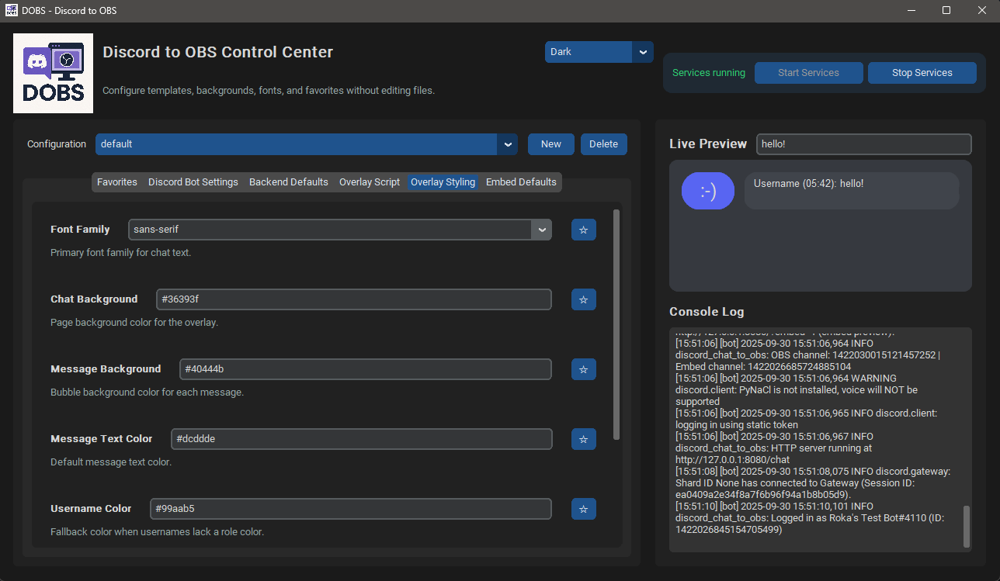

# Discord Chat Display — Super Simple Guide

<p align="center">
  
</p>

<p align="center">
  
</p>

**Show a live Discord chat on your stream or website.** Messages (including images, videos, GIFs, stickers, and custom emojis) appear instantly in a clean chat bubble. Works as an OBS overlay and as an embeddable widget for any website.

---

## What you get

- **Two views**: one for **OBS** and one for your **website embed**.  
- **Looks like Discord**: avatars, usernames, timestamps, emojis, media, and embeds.  
- **Customize everything**: fonts, colors, background image/GIF/video, and message layout.  
- **Simple control panel**: change settings right inside the app—no code required.  
- **Favorites**: pin your most‑used settings for one‑click access.

<p align="center">
  
</p>

---

## Before you start (Windows)

1) **Install Python 3.10 or newer**  
   Download from the official site and tick **Add Python to PATH** during setup.  
   https://www.python.org/downloads/

2) **Download this project**  
   - Click the green **Code** button on GitHub → **Download ZIP**.  
   - Right‑click the ZIP → **Extract All…** → pick somewhere easy (like Desktop).

3) **Install the required packages**  
   - Open the project folder in File Explorer.  
   - Click the address bar, type `cmd`, press **Enter**.  
   - In the black window, run:
     ```cmd
     pip install --upgrade pip
     pip install -r requirements.txt
     ```

---

## Create your Discord bot (one‑time)

1. Open https://discord.com/developers/applications and log in.  
2. Click **New Application** → name it (e.g. *Stream Chat Relay*) → **Create**.  
3. Go to **Bot** → **Add Bot** → confirm.  
4. On the **Bot** page:  
   - Turn on **MESSAGE CONTENT INTENT** (required).  
   - *(Presence intent is optional.)*  
   - Click **Reset Token** → copy the token (keep it private!).  
5. Go to **OAuth2 → URL Generator**:  
   - Under **Scopes**, tick `applications.commands` and `bot`.  
   - Under **Bot Permissions**, tick **View Channels**, **Read Message History**, **Send Messages**.  
   - Copy the generated URL, open it, choose your server, **Authorize**.

> You only do this once. The token is what lets the app read messages from your channel.

---

## Start the app

- Double‑click **`DOBS.bat`** *(or run `python DOBS.py`)*.  
- Click **Start Services**. You’ll see logs like:
  ```
  [http] started ...
  [bot] started ...
  ```
- When services are running, the chat is available at:
  - **OBS view:** `http://127.0.0.1:8080/`  
  - **Embed preview:** `http://127.0.0.1:8080/?embed=1`

*(These routes are served by the app’s web server—no extra setup needed.)*

---

## Set up your Discord channel

In the app:

1. Go to **Discord Bot Settings**.  
2. Paste your **Bot Token**.  
3. Set **OBS Channel ID** (and **Embed Channel ID** if you want a different channel for websites).  
4. Click **Start Services** again if you changed the token/IDs.

> Tip: If you don’t know your channel ID, right‑click the channel in Discord and choose **Copy ID** (enable Developer Mode in Discord settings).

---

## Make it look the way you want

**Background image / GIF / video**  
- In the app, find **Background Media URL** and click **Browse…**.  
  Choose a file; the app copies it into `assets/backgrounds/` and sets it automatically.  
  *(Images and videos work; videos loop.)*

**Fonts & colors**  
- Use **Font Family**, **Chat Background**, **Message Background**, **Message Text Color**, and **Username Color**.  
- Everything updates live in the preview panel.
- All variables that accept color customization should accept both Hex and RGBA color values.

**Message layout templates**  
- You decide what appears on each line. Example:
  ```html
  <strong style="color: var(--author-color, #fff)">{{author}}</strong>
  <span style="opacity:.8">{{timestamp}}</span><br>
  <span>{{message}}</span>
  ```
- Placeholders you can use:
  - `{{author}}` – the Discord display name  
  - `{{timestamp}}` – the time (honors your timestamp setting)  
  - `{{timestamp_raw}}` – the raw ISO timestamp  
  - `{{message}}` – the message content  
  - `{{newline}}` – a manual line break

**OBS**  
1. In OBS, add a **Browser Source**.  
2. Set the URL to **`http://127.0.0.1:8080/`**.  
3. Choose a width/height (e.g. 700 × 900). The chat scrolls itself; no plugins needed.

---

## Premade demo to see how the embed works!

<p align="center">
  
</p>

- Go to the demo-embed folder
- Open index.html
- Be sure you have the tool/services running, then refresh

## Add the chat to your website

### Easiest way — one script tag
```html
<div id="discord-chat"></div>
<script
  src="http://127.0.0.1:8080/embed.js"
  data-origin="http://127.0.0.1:8080"
  data-target="#discord-chat"
  data-width="960px"
  data-height="480px"
  data-chat-target="embed"
  data-background-media="/assets/backgrounds/yourfile.mp4">
</script>
```

### Plain iframe
```html
<iframe
  src="http://127.0.0.1:8080/?embed=1&chat_target=embed&transparent=1"
  style="border:0;width:100%;height:480px"
  loading="lazy" allow="autoplay"></iframe>
```

**Optional options you can pass (as data‑attributes or query params):**  
- Size: `data-width`, `data-height`, `data-min-height`, `data-max-height`  
- Colors: `data-background` (`bg`), `data-message-background`, `data-text-color`, `data-username-color`  
- Media: `data-background-media` (image/GIF/video behind the chat)  
- Font: `data-font` (`system`, `serif`, `mono`, or any CSS font stack)  
- Behavior: `data-transparent`, `data-hide-usernames`, `data-auto-resize`  
- Feed: `data-chat-target` (`embed` or `obs`)  
- API: `data-api-origin` if the JSON API lives elsewhere

---

## Pro tips (no coding needed)

- **Favorites:** Click ☆ next to any setting to pin it under **Favorites**.  
- **Stop/Start Services:** After changing settings, click **Stop Services** → **Start Services**, then reload your OBS/browser view.  
- **Auto‑resize embeds:** The iframe can grow to fit content when you enable auto‑resize.

---

## Troubleshooting

- **“Bot can’t log in”** → Regenerate your token in the Discord Developer Portal and paste it again.  
- **“No messages show up”** → Is the bot in the server? Does it have **View Channels** and **Read Message History** for that channel? Is the **Channel ID** correct?  
- **“It worked, then stopped”** → Click **Stop Services**, then **Start Services**, and reload your OBS/browser view.
- **“It's not accepting my cfg changes”** → Go to task manager (ctrl+shift+esc) then search for "Python.exe" or any python process, then force close them. Sometimes, the app can't close all of the processes correctly so it leaves old bots/servers running.
- **“It's not loading what so ever, not even the background”** → Check the settings.ini for a malformed entry. Sometimes if a typo enters a critical feild like default port etc. it can cause the tool to hang because it tries to connect to an incorrect port etc.

---

## Advanced (optional)

- The app serves the overlay and JSON chat from its built‑in web server. Main entry points:
  - **Web entry:** `web/index.html` (loads the chat and scripts)  
  - **Client bootstrap:** `web/scripts/main.js` (wires configuration → renderer)  
  - **Embed helper:** `web/embed.js` (lets any site embed with one `<script>` line)  
  - **Styling:** `web/styles.css` (backgrounds, bubbles, fonts, etc.)

---

## Support the project

If you like this project, you can support me here:  
[](https://ko-fi.com/naguroka)  
**ko‑fi.com/naguroka**

